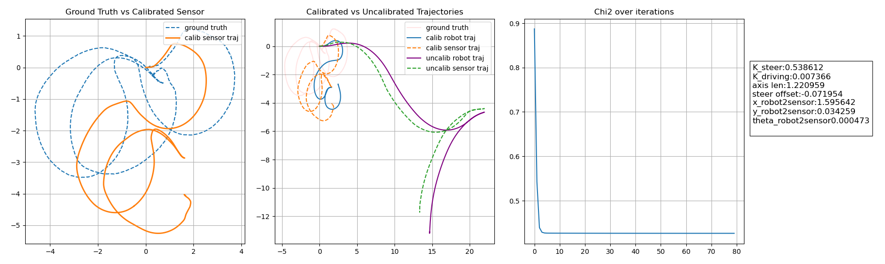

# LS-Calibration 

## Description
A calibration engine that runs a least squares optimization for a tricycle-like robot. This project is part of my exam at Sapienza University for the lectures of Professor Giorgio Grisetti [[Class Info](https://sites.google.com/diag.uniroma1.it/probabilistic-robotics-2023-24)].

For any doubts, contributions, or discussions, feel free to write an email [here](gg.dema.rm.22@gmail.com).

## Installation

### Prerequisites
- CMake
- Eigen
- Google Test (gtest)

### Build Instructions
Clone the project and build it using CMake:

```sh
# Clone the repository
git clone https://github.com/yourusername/yourproject.git Folder
cd Folder

# Initialize and update submodules (for googletest)
git submodule init
git submodule update

# Build
mkdir build && cd build
cmake ..
# Replace N with the number of CPU cores you want to use
make -jN           
```

## How to run
Exec the main file in the build folder. The final parameters are displayed on the terminal. For extra log, plot and statistics, run the script view_log.py in the ``src/script`` folder directly from there


## Results
The first plot shows the comparison between the ground truth and the obtained trajectory of the sensor (not the robot base). In the second plot, we see the difference between the original odometry of the robot (purple/green) and the results with the calibrated parameters. On the right, we have the obtained parameters for a few epochs.



